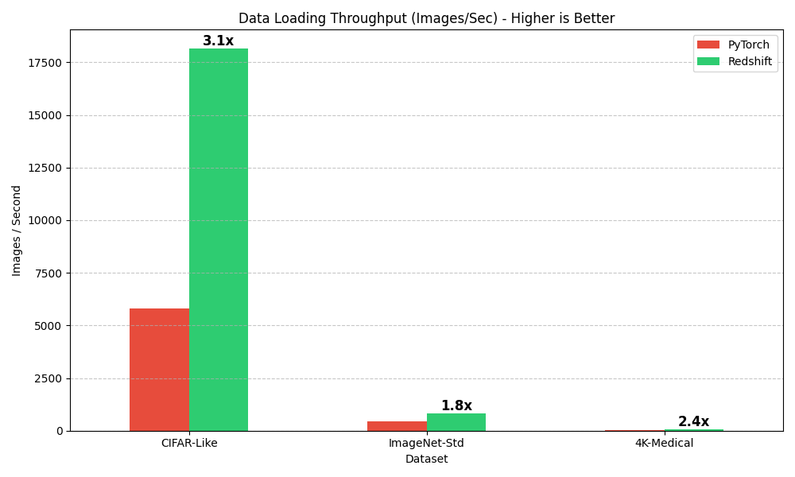

# Vantix Benchmarks

Vantix uses a Rust core (`rayon` + `fast_image_resize`) together with a pre-fetching Python thread to eliminate the I/O bottleneck that normally limits PyTorch data pipelines.
Two complementary benchmark scripts are provided:

| Script | What it measures |
|---|---|
| `benchmark_throughput.py` | **Raw data loading speed** — images per second, no training math |
| `benchmark_training.py` | **End-to-end training speedup** — full forward/backward pass with multiple model sizes |

---

## Results

### Raw Throughput (`benchmark_throughput.py`)

Tested across three dataset profiles that stress different parts of the I/O stack.



| Dataset | PyTorch (img/s) | Vantix (img/s) | Speedup |
|---|---|---|---|
| CIFAR-Like (32 px) | ~5 900 | ~18 100 | **3.1×** |
| ImageNet-Std (224 px) | ~450 | ~820 | **1.8×** |
| 4K-Medical (2048→224) | ~30 | ~72 | **2.4×** |

> PyTorch baseline uses `ImageFolder` + `DataLoader` with `num_workers=os.cpu_count()` and `pin_memory=True`.
> Vantix uses a single background thread with a prefetch queue of 3 batches.

---

### Rigorous Statistical Benchmark (`benchmark_throughput.py` — 3 trials, mean ± std dev)


| Scenario | PT Mean (img/s) | Vantix Mean (img/s) | Speedup |
|---|---|---|---|
| Medical-2K-Proxy | ~65 | ~180 | ~2.8× |
| CIFAR-32-Proxy | ~1 750 | ~16 400 | **~9.4×** |
| ImageNet-Std | ~420 | ~1 020 | ~2.4× |

> Error bars show ±1 standard deviation across 3 trials. Vantix variance is consistently lower.

---

## Running the Benchmarks Yourself

### Prerequisites

Build the Rust extension in release mode:

```bash
maturin develop --release
```

### 1 — Prepare Data

Downloads CIFAR-10 and saves images as individual PNG files on disk:

```bash
python benchmarks/prepare_data.py
```

### 2 — Raw Throughput

```bash
python benchmarks/benchmark_throughput.py
```

Charts saved to `assets/`.

### 3 — Training Speedup

Run all models (default):

```bash
python benchmarks/benchmark_training.py
```

Run a specific model or combination:

```bash
python benchmarks/benchmark_training.py --models Small_MLP
python benchmarks/benchmark_training.py --models Small_MLP Medium_CNN
```

Available models: `Small_MLP`, `Medium_CNN`, `Large_MobileNetV3`

Charts saved to `assets/`.
