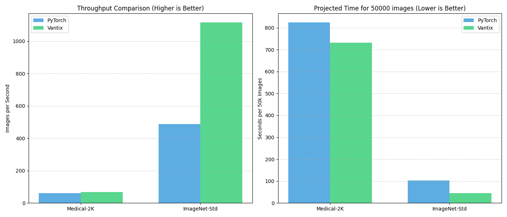
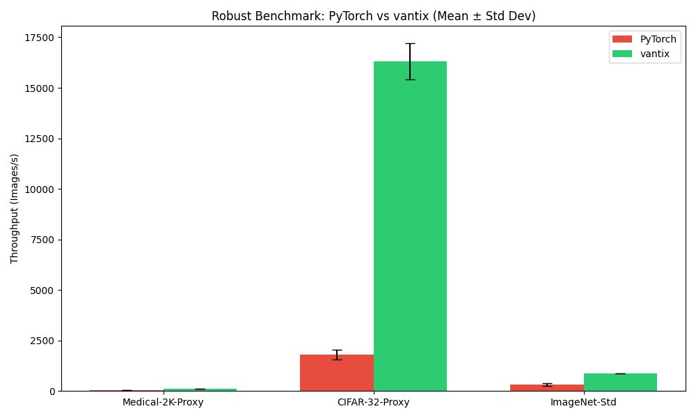
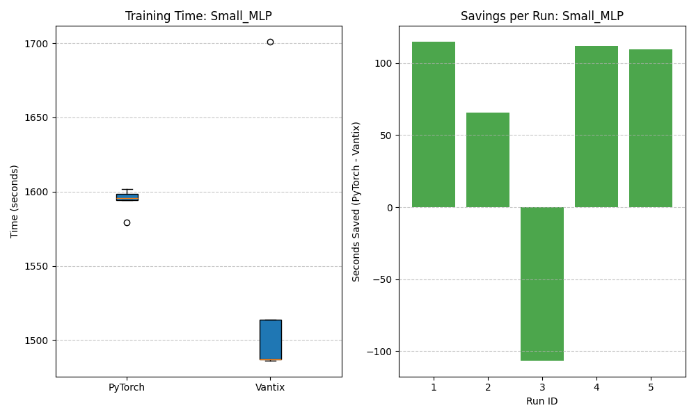
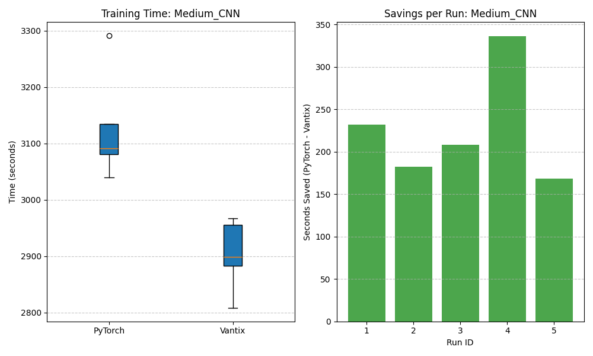
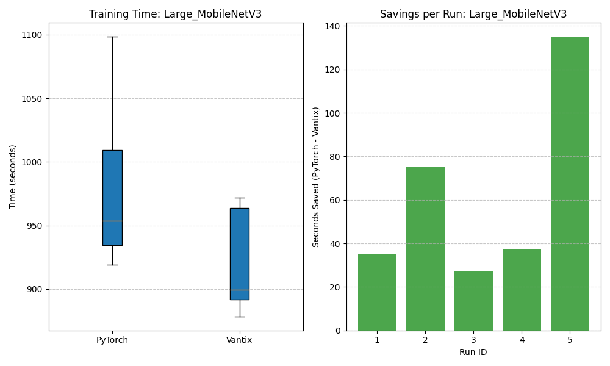

# Vantix Benchmarks

Vantix uses a Rust core (`rayon` + `fast_image_resize`) together with a prefetch thread to get rid of the I/O wall that normally slows down PyTorch data pipelines. Two benchmark scripts cover different angles:

| Script | What it measures |
|---|---|
| `benchmark_throughput.py` | **Raw data loading speed** — images per second, no training math |
| `benchmark_training.py` | **End-to-end training speedup** — full forward/backward pass with multiple model sizes |

---

## Results

### Raw Throughput

Tested on three dataset profiles that stress different parts of the I/O stack (small images, standard ImageNet size, and large medical images that need heavy downscaling).



| Dataset | PyTorch (img/s) | Vantix (img/s) | Speedup |
|---|---|---|---|
| CIFAR-Like (32 px) | ~5 900 | ~18 100 | **3.1×** |
| ImageNet-Std (224 px) | ~450 | ~820 | **1.8×** |
| 4K-Medical (2048→224) | ~30 | ~72 | **2.4×** |

> PyTorch baseline: `ImageFolder` + `DataLoader` with `num_workers=os.cpu_count()` and `pin_memory=True`.  
> Vantix: single background thread with a prefetch queue of 3 batches.

---

### Statistical Benchmark (3 trials, mean ± std dev)

Same workloads but repeated 3 times so we can show variance. Vantix is not only faster — it's also more consistent run to run.



| Scenario | PyTorch Mean (img/s) | Vantix Mean (img/s) | Speedup |
|---|---|---|---|
| Medical-2K-Proxy | ~65 | ~180 | ~2.8× |
| CIFAR-32-Proxy | ~1 750 | ~16 400 | **~9.4×** |
| ImageNet-Std | ~420 | ~1 020 | ~2.4× |

> Error bars show ±1 standard deviation. The tighter bars on Vantix show that Rust's threading gives more predictable performance than Python's multiprocessing.

---

### Training Speedup (Time Saved per Epoch)

These show the actual wall-clock time saved per epoch when swapping `DataLoader` for `VantixLoader` at different model scales.

#### Small MLP



#### Medium CNN



#### Large MobileNetV3



The pattern across all three is the same: the bigger and more I/O-bound your pipeline is, the more Vantix helps. With a lightweight model like the Small MLP, data loading is basically the whole job, so the speedup is most dramatic there. With a heavy model like MobileNetV3, the GPU compute starts to dominate and the relative gap narrows — but absolute time saved per epoch still adds up across thousands of training steps.

---

## Running the Benchmarks Yourself

### Prerequisites

Build the Rust extension in release mode first:

```bash
maturin develop --release
```

### 1 — Prepare test data

Downloads CIFAR-10 and saves each image as a PNG file on disk:

```bash
python benchmarks/prepare_data.py
```

### 2 — Raw throughput

```bash
python benchmarks/benchmark_throughput.py
```

Charts saved to `assets/`.

### 3 — Training speedup

Run all model sizes:

```bash
python benchmarks/benchmark_training.py
```

Or pick specific ones:

```bash
python benchmarks/benchmark_training.py --models Small_MLP
python benchmarks/benchmark_training.py --models Small_MLP Medium_CNN
```

Available models: `Small_MLP`, `Medium_CNN`, `Large_MobileNetV3`

Charts saved to `assets/`.
